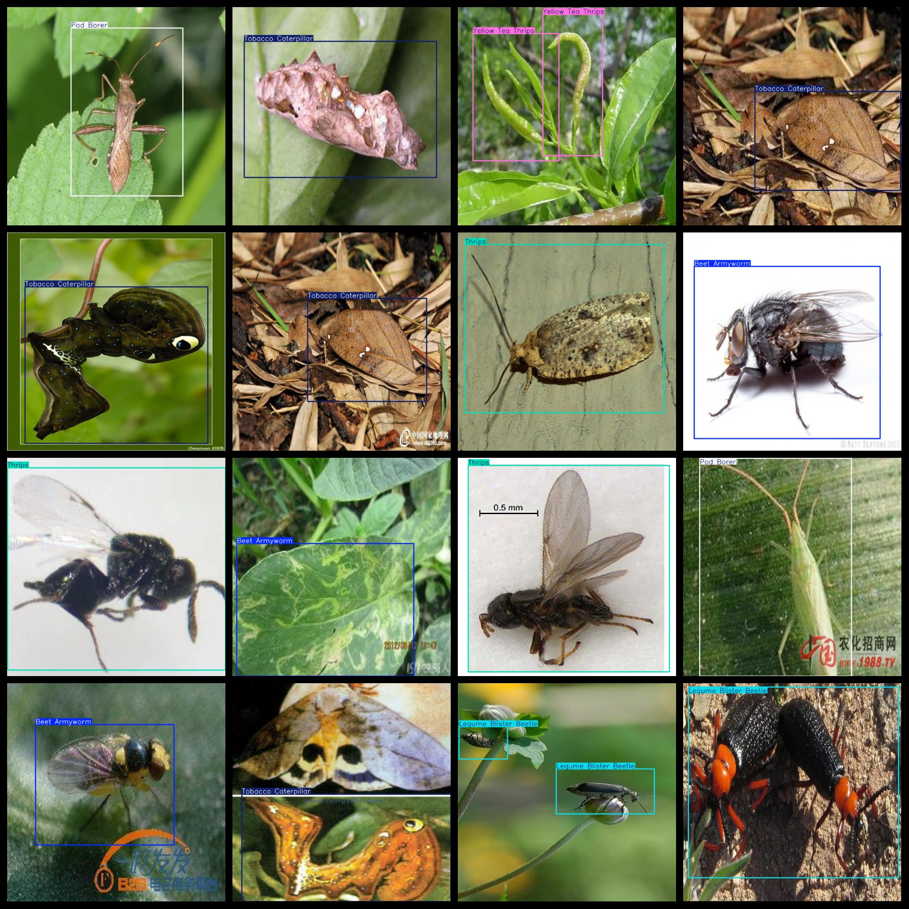
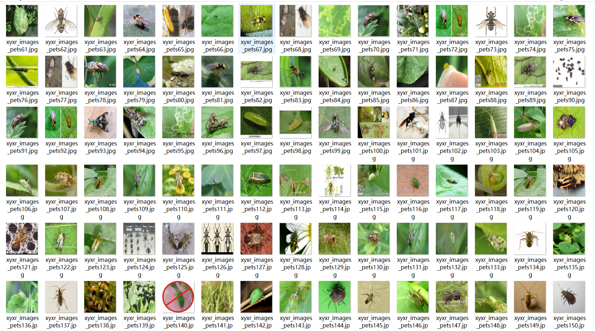

# Insect Classification Detection Dataset 649 Images VOC+YOLO

The insect classification detection dataset consists of 649 images, organized in the VOC format plus YOLO format. The dataset is packaged into three folders: JPEGImages, Annotations, and labels.

In the JPEGImages folder, there are a total of 649 JPEG images.

In the Annotations folder, there are a total of 649 XML files.

Lastly, in the labels folder, there are a total of 649 txt files.

The number of label categories is 6. These include: ["Beet Armyworm", "Legume Blister Beetle", "Pod Borer", "Thrips", "Tobacco Caterpillar", and "Yellow Tea Thrips"].

Each label has its corresponding number of boxes (note that the order of classes in the YOLO format may differ from this list, but is based on the classes.txt file in the labels folder).

For instance, the number of boxes for "Beet Armyworm" is 202, "Legume Blister Beetle" is 115, "Pod Borer" is 146, "Thrips" is 140, "Tobacco Caterpillar" is 128, and "Yellow Tea Thrips" is 220.

The total number of boxes is 951.

The images are all of high resolution clarity.

No image enhancement was applied to them.

The shape of the labeled images is rectangular boxes, used for target detection recognition.

Important Notes: There are no guarantees made by this dataset regarding the accuracy of the models trained on it or any weight files. The dataset only provides accurate and reasonable annotations.

Special Statement: This dataset does not guarantee any level of accuracy or precision for the models trained on it, or any weights files. The dataset provides accurate and reasonable annotations only.

## Images

---

Here is a pay link on Stripe (https://buy.stripe.com/3cs8yP7sY87d0vu9AB). Please contact me lonlonago@foxmail.com after funding $89, and I will send you a complete data files, thank you!

